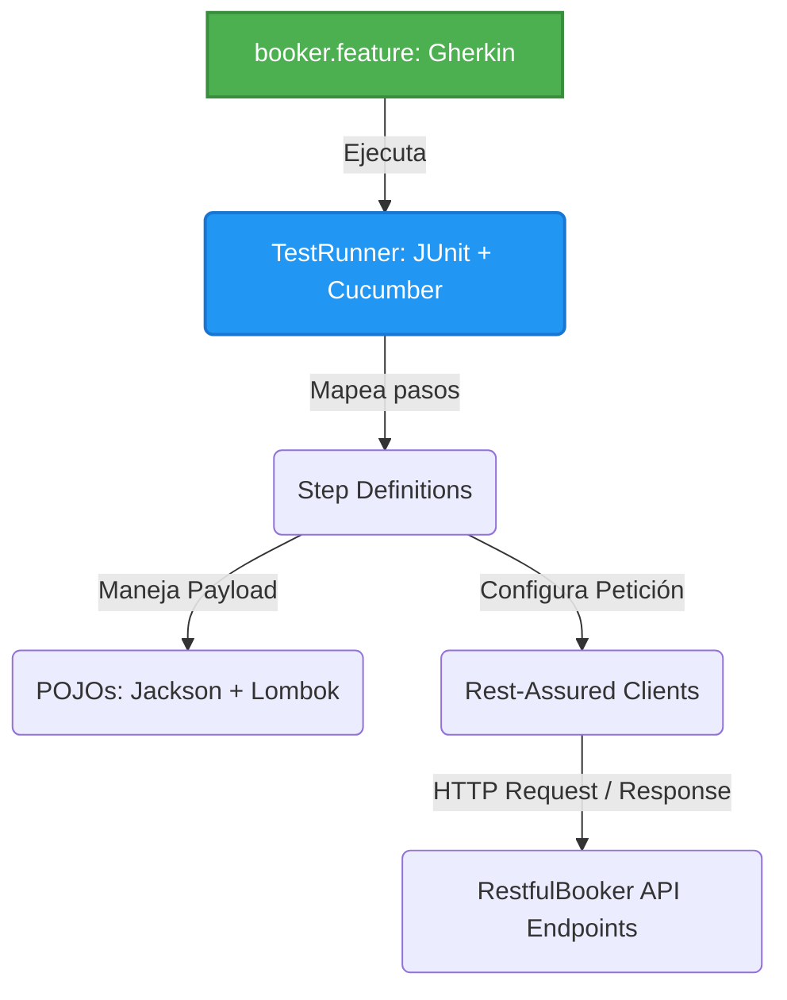

# CERTIFICACIÓN 2 - Framework BDD RestfulBooker API

Proyecto de automatización de pruebas BDD (Behavior Driven Development) para la API de reservas **RestfulBooker**. El objetivo principal es evaluar los endpoints críticos del negocio (CRUD de reservas y autenticación), integrando lenguaje natural (Gherkin) con **Rest-Assured** para las peticiones HTTP, manejo de POJOs para la serialización de datos y generación de reportes avanzados.

## Arquitectura del Proyecto (BDD + API Services)

El framework está diseñado combinando Cucumber para la orquestación de comportamientos de negocio y Rest-Assured para la ejecución técnica de las peticiones HTTP. Se apoya en Jackson y Lombok para el mapeo de objetos (Serialización/Deserialización), garantizando un código limpio y una clara separación entre los pasos de prueba y el cliente de la API.

## Stack Tecnológico

| **Herramienta**  | **Versión** | **Uso en el Proyecto**                                                              |
| ---------------- | ----------- | ----------------------------------------------------------------------------------- |
| Java             | 26          | Lenguaje de programación base.                                                      |
| Rest-Assured     | 5.5.0       | Cliente HTTP para la construcción, envío y validación de peticiones a la API.       |
| Cucumber         | 7.34.7      | Framework BDD para la definición y mapeo de pruebas en lenguaje Gherkin.            |
| JUnit            | 6.1.3       | Motor de ejecución para los escenarios de Cucumber (`TestRunner`).                  |
| Jackson Databind | 2.18.2      | Serialización (POJO a JSON) y Deserialización (JSON a POJO) de los payloads.        |
| Lombok           | 1.18.36     | Reducción de código repetitivo (Boilerplate) en la creación de los modelos (POJOs). |
| Extent Reports 7 | 1.14.0      | Generación automática de reportes de prueba en formato HTML interactivo.            |

## Escenarios Automatizados (Gherkin Concepts)

Se desarrollaron los escenarios del ciclo de vida de una reserva. Se implementó un **`Background`** para la generación del Token de autenticación (`/auth`), necesario para las operaciones seguras:

| **#** | **Escenario**           | **Concepto BDD**   | **Descripción de la Validación**                                                                                                                               |
| ----- | ----------------------- | ------------------ | -------------------------------------------------------------------------------------------------------------------------------------------------------------- |
| 1     | Autenticación y Token   | `Background`       | Genera un token de acceso válido previo a la ejecución de escenarios que requieren autorización (PUT, PATCH, DELETE).                                          |
| 2     | Creación de Reserva     | `DataTable`        | Envía un payload estructurado desde el Feature para crear una reserva mediante el método `POST`, validando el código 200 y el esquema de respuesta.            |
| 3     | Consulta de Reserva     | `Scenario`         | Extrae el ID de una reserva existente y realiza un `GET` para verificar que los datos almacenados correspondan a la información enviada.                       |
| 4     | Actualización de Fechas | `Scenario Outline` | Utiliza `Examples` para inyectar diferentes rangos de fechas (Checkout/Checkin) evaluando la respuesta del método `PUT` o `PATCH`.                             |
| 5     | Eliminación Segura      | `Scenario`         | Realiza una petición `DELETE` con el token de autorización, validando el status code 201 (Created) y confirmando con un `GET` que devuelva un 404 (Not Found). |

## Resultados de las Pruebas y Reportes

Se ejecutó la suite mediante la clase `TestRunner` utilizando JUnit. Al finalizar, el plugin de ExtentReports autogenera la carpeta `test-output` con métricas detalladas de los endpoints evaluados.

**Resultado de la ejecución:**

| **Indicador**              | **Resultado**                    |
| -------------------------- | -------------------------------- |
| Casos de prueba ejecutados | 5                                |
| Casos de prueba fallidos   | 0                                |
| Reportes Generados         | `Spark.html` / `ExtentHtml.html` |
| Exit code                  | `0`                              |

> **Nota Técnica sobre Logging:** Para facilitar la depuración, Rest-Assured está configurado con filtros `.log().all()` o `.log().ifValidationFails()`, lo que permite trazar en consola los Headers, Body y Status Code exactos de cada transacción HTTP en caso de que la API de RestfulBooker presente intermitencias (frecuente en este entorno de pruebas público).

## Ejecución Local

1. Clonar el repositorio en el equipo local.
2. Abrir el proyecto en IntelliJ IDEA.
3. Sincronizar Maven (botón *Reload All Maven Projects*) para descargar las dependencias correctamente (especialmente Lombok para evitar errores de compilación en los POJOs).
4. Navegar a `src/test/java/runners/TestRunner.java` y ejecutar la clase.
5. Una vez finalizada la ejecución, abrir la carpeta autogenerada `test-output/` en la raíz del proyecto para visualizar los reportes (ej. abrir `SparkReport/Spark.html` en tu navegador web).